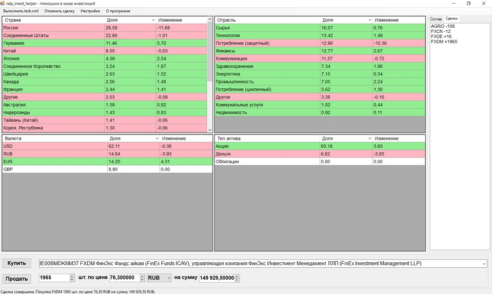

# ndp_invest_helper
Бесплатный анализатор диверсификации портфеля с открытым кодом. Помощник в мире инвестиций на фондовом рынке для консервативного инвестора. [Официальный сайт](https://github.com/dnezamaev/ndp_invest_helper).

## Что делает?
С помощью программы можно оценить насколько качественно сбалансированы Ваши инвестиции по разным критериям. Программа показывает диверсификацию портфеля по типу активов, секторам экономики, валютам, странам. Также можно эмулировать сделки купли/продажи для ребалансировки портфеля.

## Как пользоваться?

Скачать собранную версию можно [здесь](https://github.com/dnezamaev/ndp_invest_helper/releases), во вкладке assets с пометкой bin в названии. Скорее всего Windows будет ругаться на недоверенный источник и т.п. Причина в отсутствии подписи у приложения. Если опасаетесь, проверьте антивирусом.

[Руководство пользователя](UserManual.md)

## Зачем нужна?
В России выгодно открывать несколько инвестиционных счетов (по одному ИИС на каждого члена семьи в связи с ограничениями по размеру ИИС). Но хотелось бы вести семейный бюджет и следить за качеством совокупного портфеля в одном месте.

Пробовал IntelInvest, SmartLab, IziInvest, приложение брокера и таблицы Excel наконец. Но все они работают очень топорно в части распределения активов. Красиво - да, удобно - да. Но ни один из них не смотрит внутрь ETF, внутрь эмитента и не дает качественного анализа.

Согласитесь, FXUS вносит в портфель приличную долю IT сектора. Сбербанк уже не только финансовая организация. Огромные корпорации строят свои экосистемы, охватывают сразу несколько секторов экономики, работают в разных странах.

С валютами тоже не всё однозначно. К какой валюте отнести FXDM (фонд на развитые страны) или VTBE (фонд на развивающиеся страны)? К валюте фонда? Сомнительно. Это мультивалютные по своей сути фонды.

Аналогично с типами активов. Мне не нужна информация, что в моем портфеле 35% ETF. Хочется распределить их содержимое по настоящим бумагам. FXUS к акциям, FXRU к облигациям, вечные портфели Тинькофф к соответствующим активам в указанных долях.

То же самое по странам. Куда отнести FXWO (фонд на весь мир)? Ирландия по формальному признаку? Ну бред же. Надо распаковать его по всем странам в долях, указанных в проспекте фонда.

В итоге, я решил вспомнить старый добрый C# и написать свой анализотор под свои нужды. А являясь сторонником открытого ПО, решил поделиться своими трудами со всеми желающими.

Если Вы консервативный инвестор и стремитесь минимизировать риски, то эта программа может Вам помочь. Спекулянтам и желающим быстрых прибылей она вряд ли пригодится.

## Ключевые достоинства

* Глубокий анализ. Программа позволяет заглянуть внутрь эмитента, распаковать фонд. А затем показать реальное положение дел в портфеле.
* Настраиваемость. Открытая легко редактируемая база активов. Все данные хранятся в текстовых файлах формата XML. Без особых знаний IT Вы можете поправить любой файл и сделать свою версию базы. Считаете, что FXDM на самом деле не долларовый актив, а мультивалютный? Просто поправьте параметр currency у этого фонда. Полный контроль в Ваших руках.
* Независимость от Интернета. Ваши персональные и финансовые данные никуда не утекут. Программе не нужно подключение к сети для работы. Достаточно файлов с отчетами брокера. В случае обострения паранои, можно удалить из отчета все лишние сведения (ФИО, ИНН, даты и т.п), программе они не нужны.

## Хотите помочь?
Замечатально! Сейчас проект находится на стадии глубокой альфа версии и очень далек от конечного продукта для всех и каждого, наверняка содержит ошибки. Вы можете помочь развитию проекта следующим:

* Дополнить базу issuers.xml по Питерской и другим биржам. Меня интересует только Мосбиржа, так как я не покупаю отдельные иностранные бумаги, поэтому сам я вряд ли когда-либо буду искать по ним информацию.
* Дополнить информацию по секторам экономики уже имеющихся бумаг. Тут всё сложно. Мне не удалось найти единой стандартной классификации отраслей и секторов экономики. Кое-что я нашел и заполнил, но это малая часть. Если вы разбираетесь в теме, я бы с удовольствием послушал как сделать правильно.
* Тестирование. Если вы умеете программировать на C#, можете написать unit-тесты и поискать ошибки в коде. Если нет, можете потестить на своих отчетах и сверить вручную. О любых ошибках можно сообщать на github или почту.
* Предложить свои идеи по проекту. Возможно, я их реализую, но это не точно. ;-)

Просьба не предлагать продвижение, маркетинг и прочую ерунду. Это некоммерческий проект.

## Планы на будущее

[Список задач](TODO.md).

## Лицензия и ответственность.

Программа распространяется под лицензией GNU GPL 3. Если коротко - можно копировать, дорабатывать, выкладывать у себя при условии, что вы сохраняете положения исходной лицензии в своей доработанной или скопированной версии. Запрещается продавать программу или иным способом извлекать из неё выгоду за исключением прямого разрешения автора. Автор - Незамаев Дмитрий Павлович, dnezamaev@gmail.com. Автор не несет какой-либо ответственности за убытки, связанные с использованием программы. Полный текст лицензии указан в прилагаемом к программе файле [COPYING.txt](COPYING.txt).

Все сведения по бумагам взяты из открытых источников. Если Вы считаете, что Ваши права нарушены, свяжитесь со мной.

Copyright (C) 2021 Dmitriy Nezamaev (dnezamaev@gmail.com).

ndp_invest_helper is free source software: you can redistribute it and/or modify it under the terms of the GNU General Public License as published by the Free Software Foundation, either version 3 of the License, or (at your option) any later version.

ndp_invest_helper is distributed in the hope that it will be useful, but WITHOUT ANY WARRANTY; without even the implied warranty of MERCHANTABILITY or FITNESS FOR A PARTICULAR PURPOSE. See the GNU General Public License for more details.

You should have received a copy of the GNU General Public License along with ndp_invest_helper. If not, see <http://www.gnu.org/licenses/>.

Использованные компоненты (used components):
* EasyCompletionComboBox. Author: Serge Weinstock. License: LGPL3

